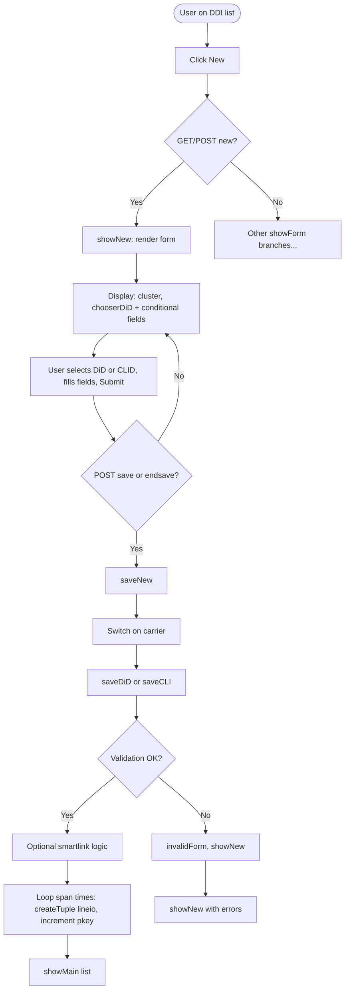
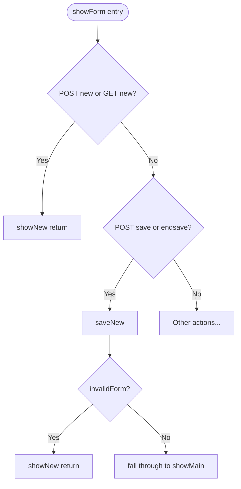
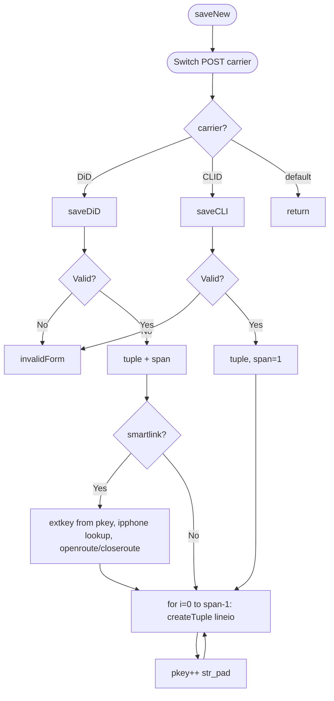
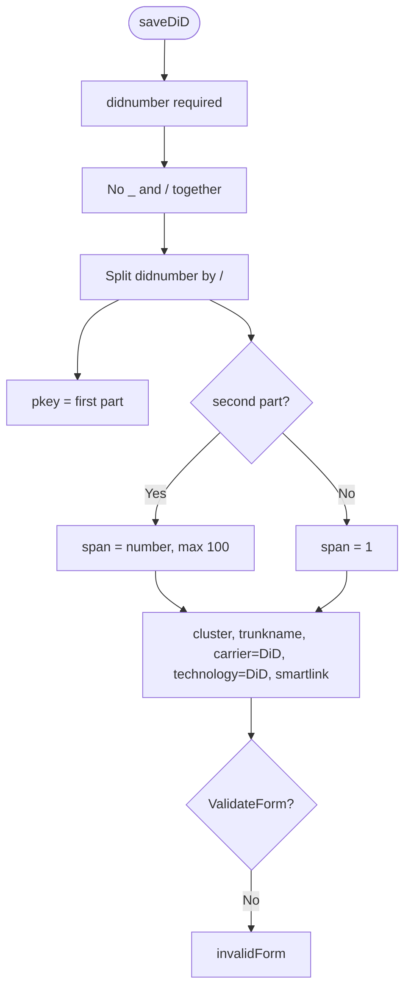
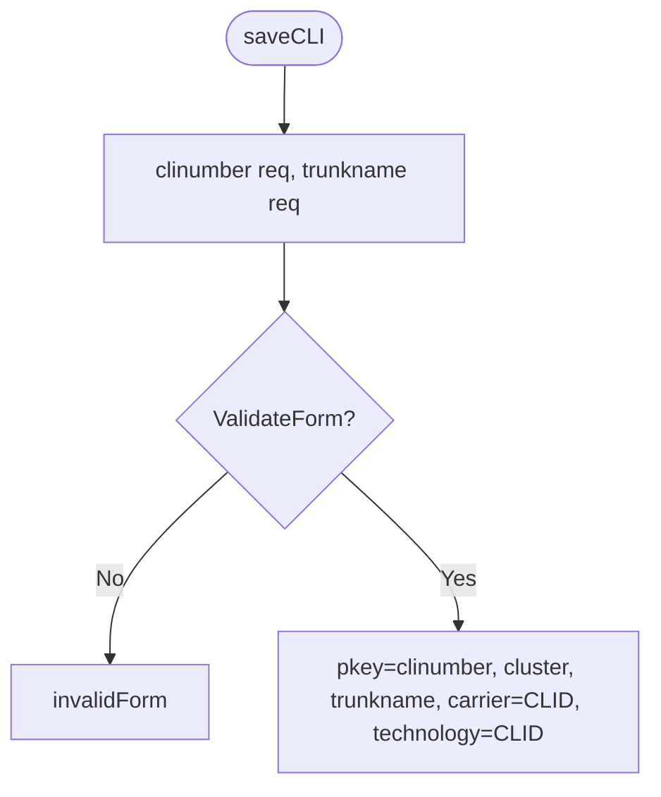
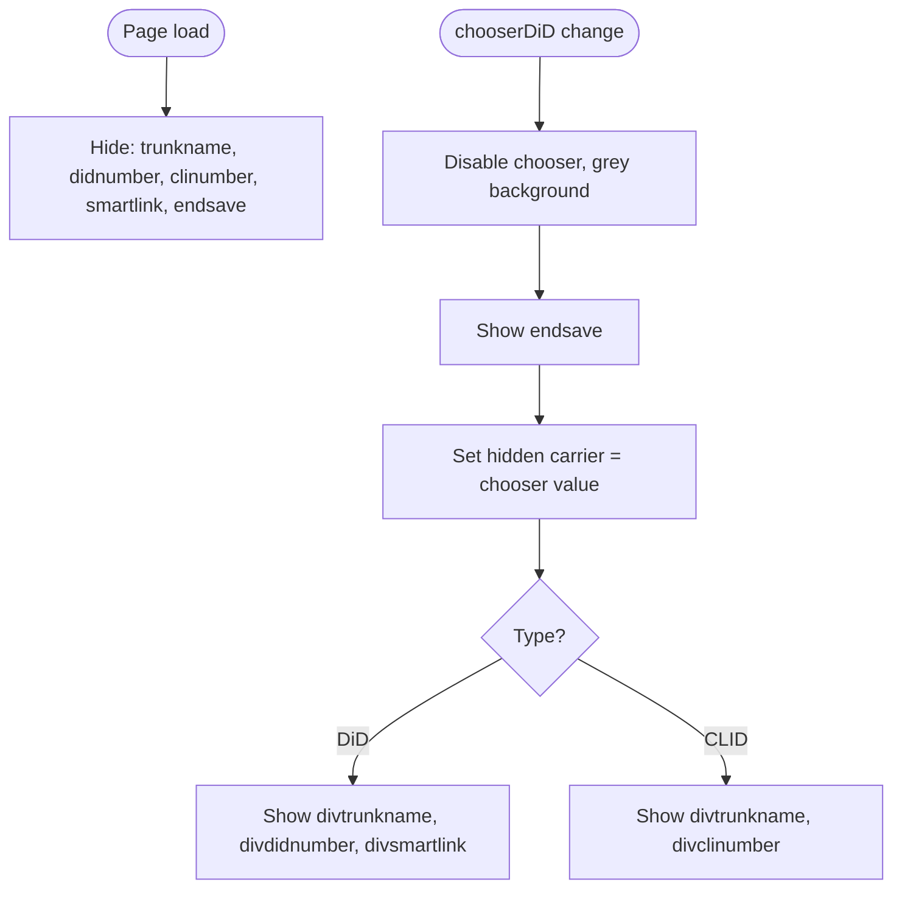
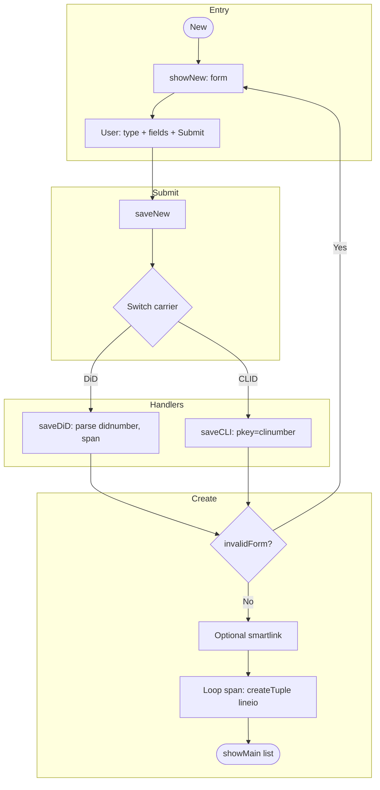

# DDI Add – Logic Flow (for SPA replacement)

Flowchart of logic paths through the “add new DDI/CLID” code.

---

## 1. High-level flow (entry → outcome)

---

## 2. showForm() routing (add-related branches only)

---

## 3. saveNew() – switch and loop

---

## 4. saveDiD – validation and tuple

---

## 5. saveCLI – validation and tuple

---

## 6. Client-side (current JS) – type → visible fields

---

## 7. Full create path (simplified)

---

*Working notes – DDI add flowcharts for SPA replacement.*
