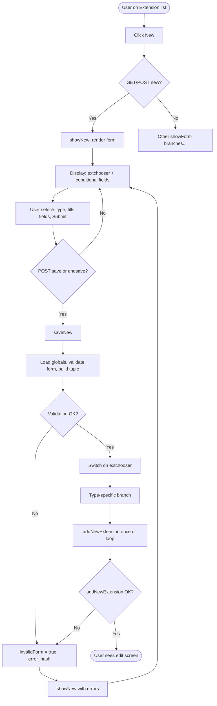
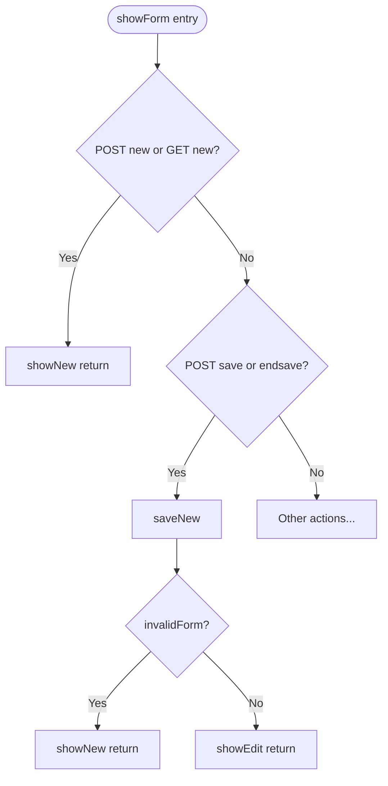
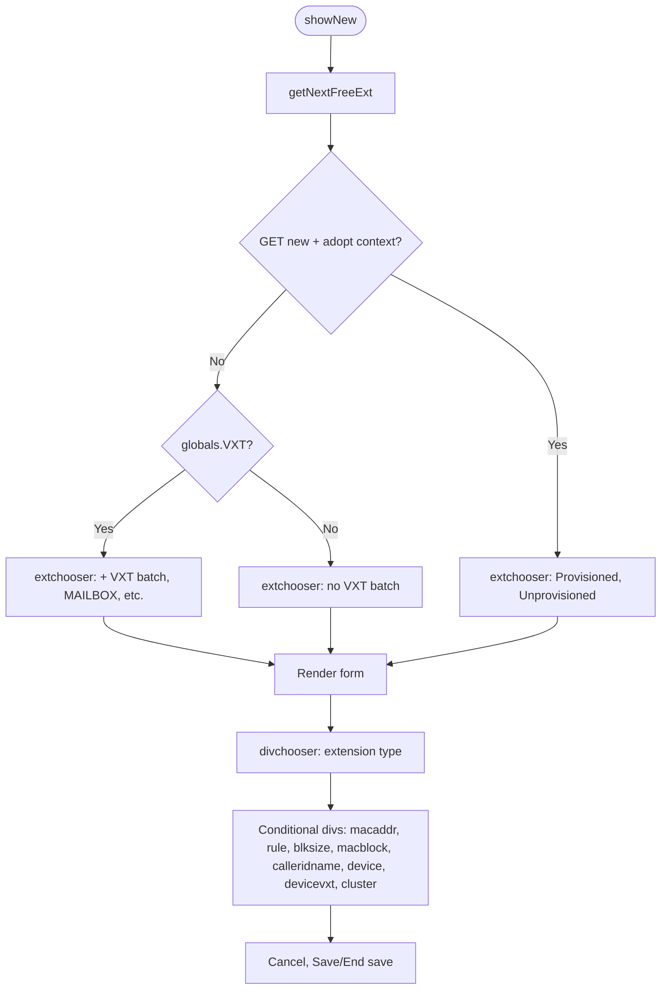
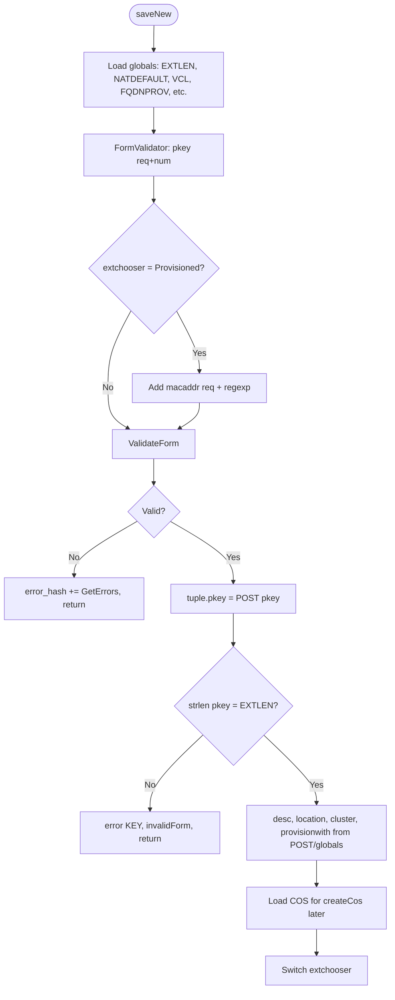
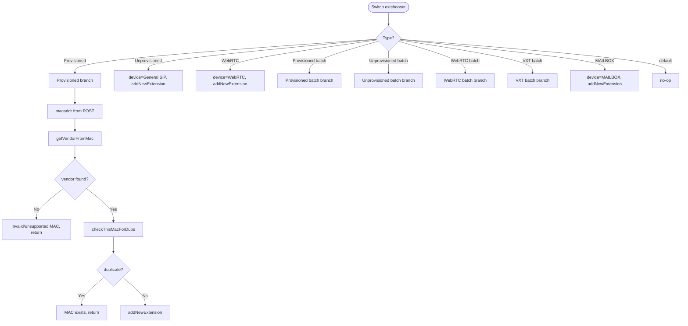
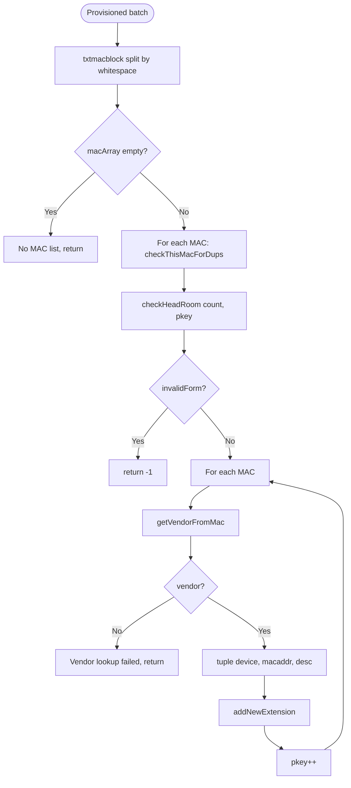
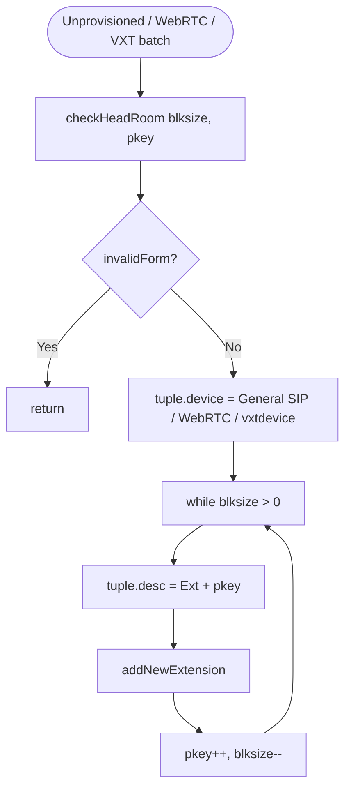
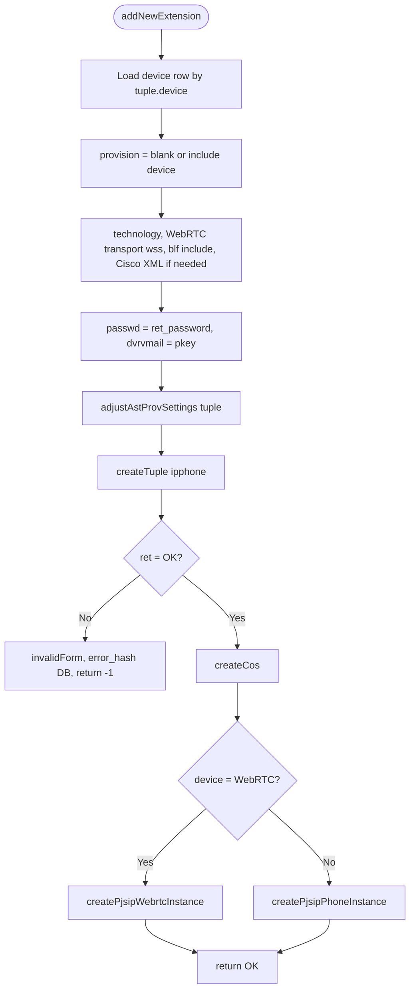
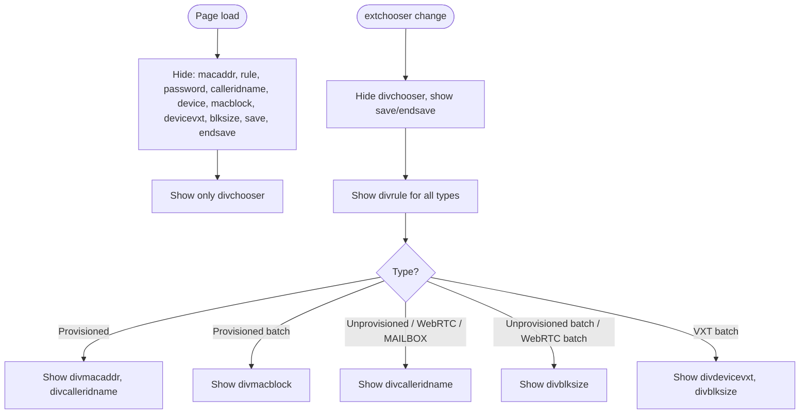
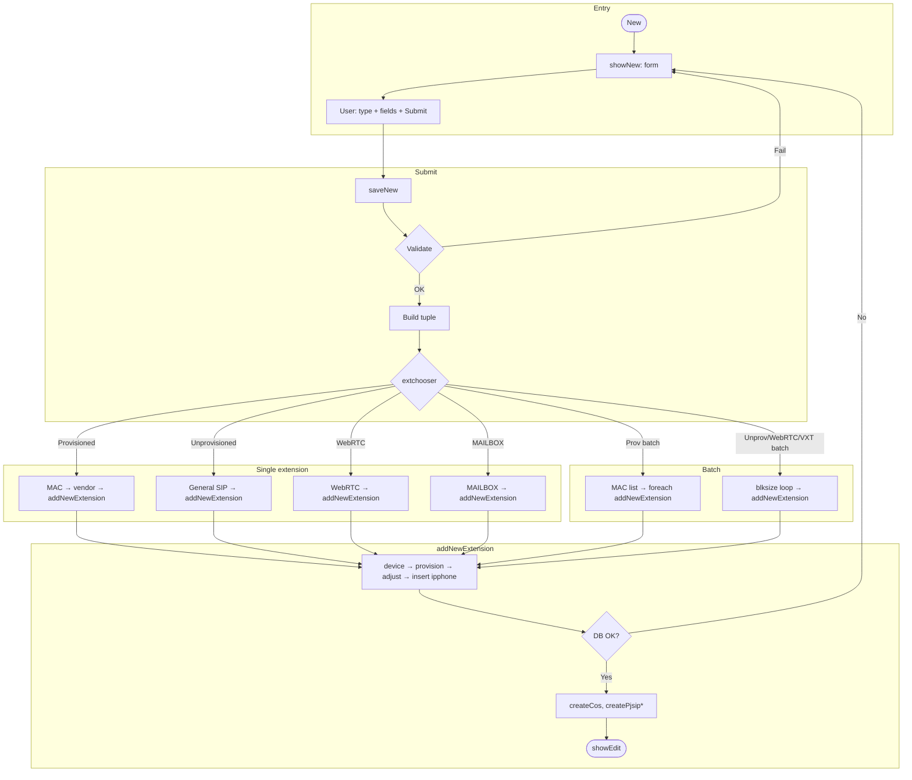

# Extension Add – Logic Flow (for SPA replacement)

Flowchart of all logic paths through the “add new extension” code. Use this to design the same behaviour in a modern SPA (API + client steps).

---

## 1. High-level flow (entry → outcome)

---

## 2. showForm() routing (add-related branches only)

---

## 3. showNew() – form build

---

## 4. saveNew() – validation and tuple build

---

## 5. saveNew() – switch on extension type (main branches)

---

## 6. Provisioned batch branch (detail)

---

## 7. Unprovisioned / WebRTC / VXT batch (common pattern)

---

## 8. addNewExtension(tuple) – single-extension create

---

## 9. Client-side (current JS) – type → visible fields

---

## 10. Single diagram – full create path (simplified)

One view of the whole create path from “New” to “Edit” or “New again”:

---

## How to use this for the SPA

1. **API surface:** One or more endpoints that mirror `saveNew()` + `addNewExtension()`: e.g. `POST /api/extensions` with body `{ extChooser, pkey, macaddr?, txtmacblock?, blksize?, vxtdevice?, desc?, cluster? }`. Server runs the same validation and switch logic, returns created extension id(s) or validation errors.
2. **Client flow:**  
   - Step 1: Fetch “next free ext” and type options (or derive from globals).  
   - Step 2: Single form with type selector; show/hide fields by type (same as diagrams 3 and 9).  
   - Step 3: On submit, call create API; on success navigate to edit (or list); on validation errors show errors and stay on form (same as diagram 1).
3. **Batch:** API either accepts one extension per request (client loops) or a batch payload (server loops) – diagram 6 and 7 define the server-side loop and checks.
4. **addNewExtension** steps (diagram 8) stay server-side (DB + PJSIP instance creation); SPA only triggers them via the API.

---

*Working notes – flowcharts for SPA replacement planning.*
