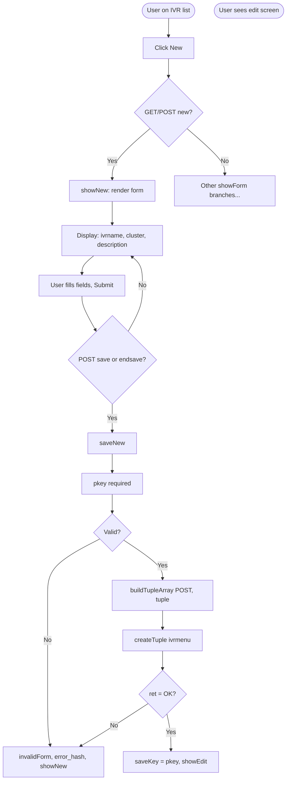
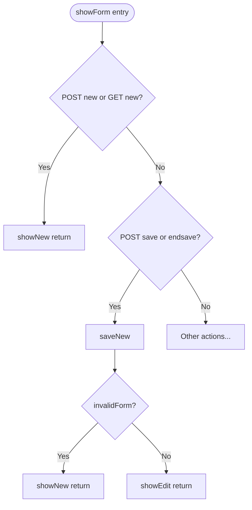
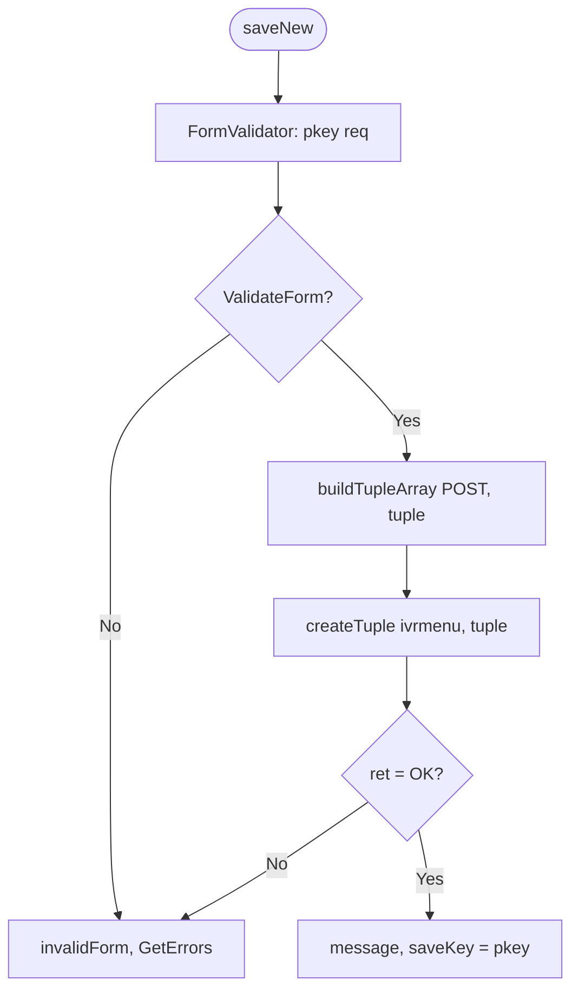

# IVR Add – Logic Flow (for SPA replacement)

Flowchart of logic paths through the “add new IVR” code.

---

## 1. High-level flow (entry → outcome)

---

## 2. showForm() routing (add-related branches only)

---

## 3. saveNew() – validation and create

---

## 4. Client-side (IVR create)

IVR create has no conditional UI; all fields (ivrname, cluster, description) are always visible. No show/hide logic in JS for the new form.

---

*Working notes – IVR add flowcharts for SPA replacement.*
