# Trunk Add – Logic Flow (for SPA replacement)

Flowchart of logic paths through the “add new trunk” code. Use this to design the same behaviour in a modern SPA.

---

## 1. High-level flow (entry → outcome)

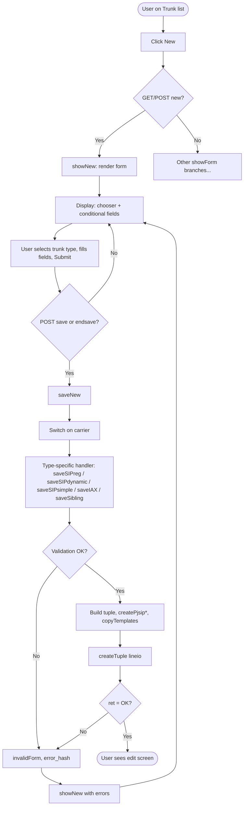

---

## 2. showForm() routing (add-related branches only)

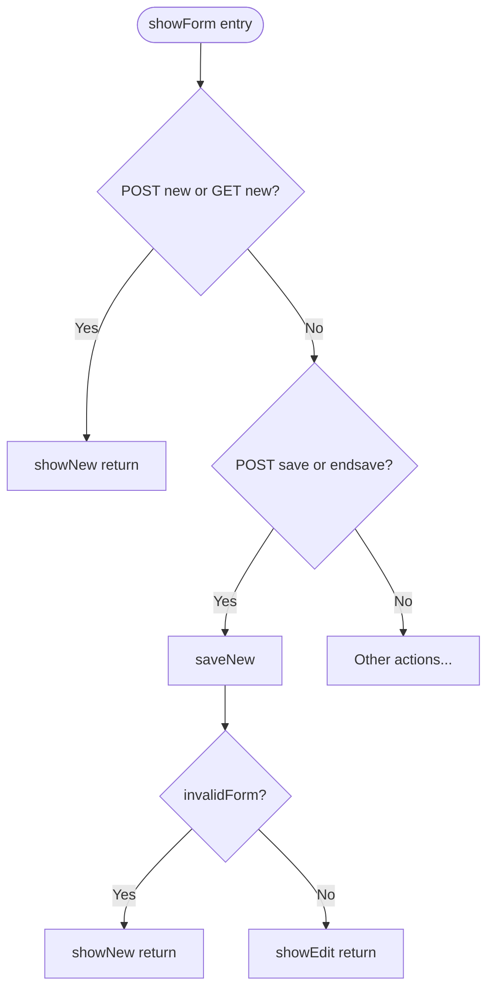

---

## 3. showNew() – form build

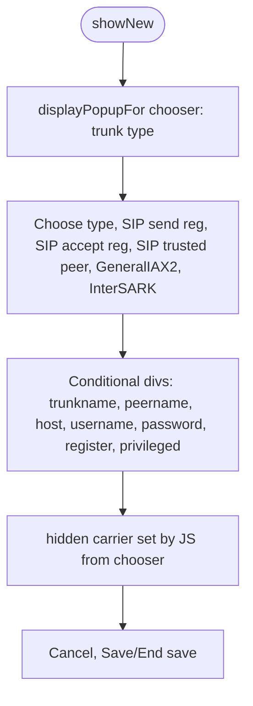

---

## 4. saveNew() – switch on carrier

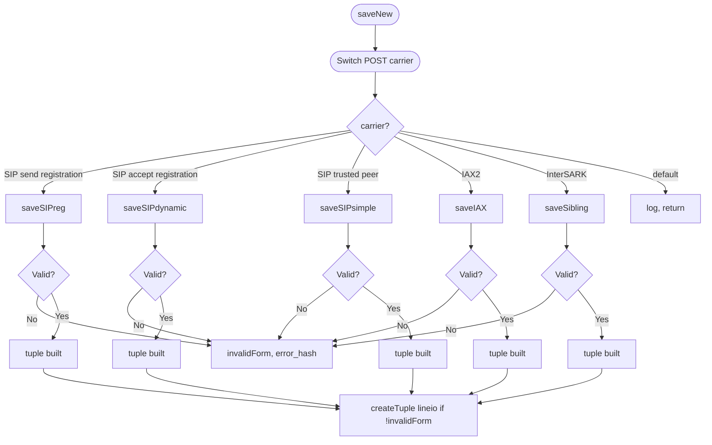

---

## 5. SIP send registration (saveSIPreg)

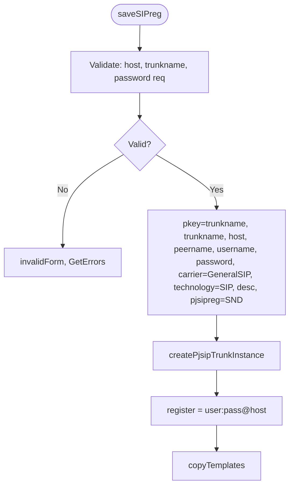

---

## 6. SIP accept registration (saveSIPdynamic)

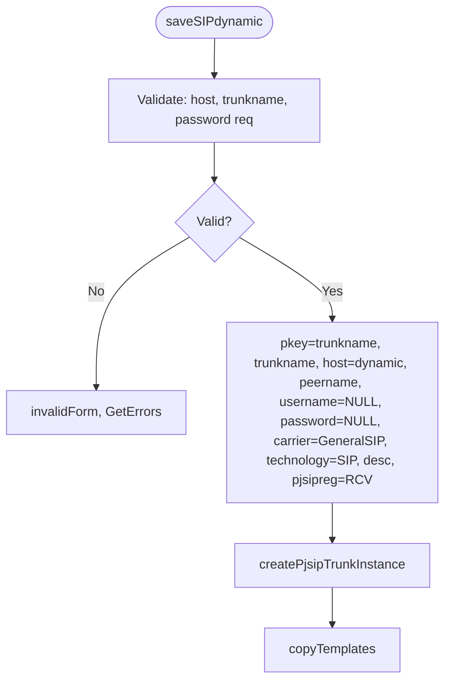

---

## 7. SIP trusted peer (saveSIPsimple)

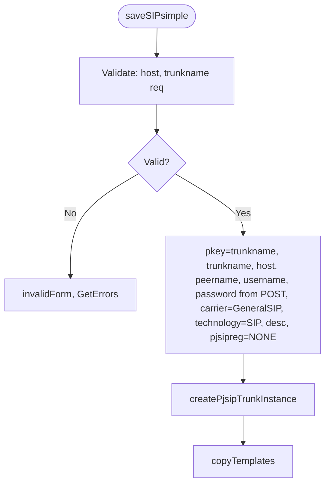

---

## 8. GeneralIAX2 (saveIAX) – note: switch case is IAX2

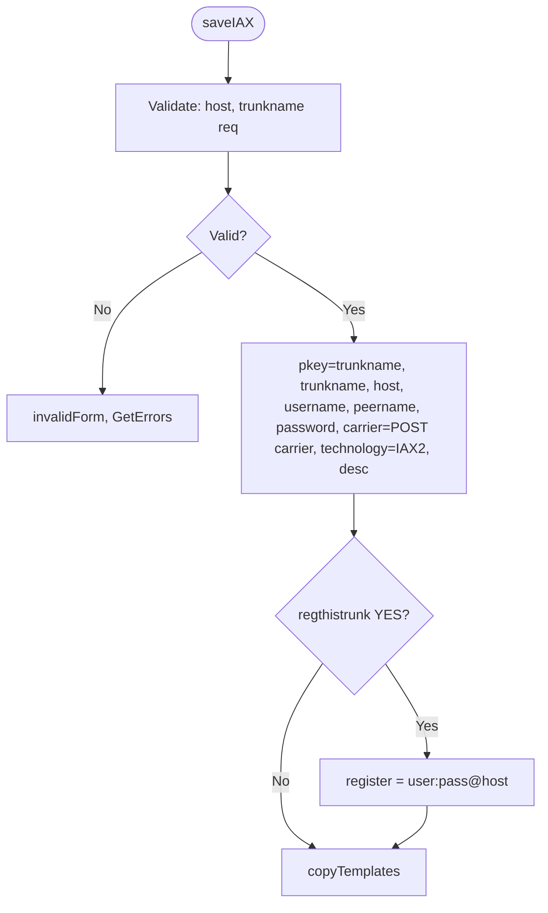

---

## 9. InterSARK (saveSibling)

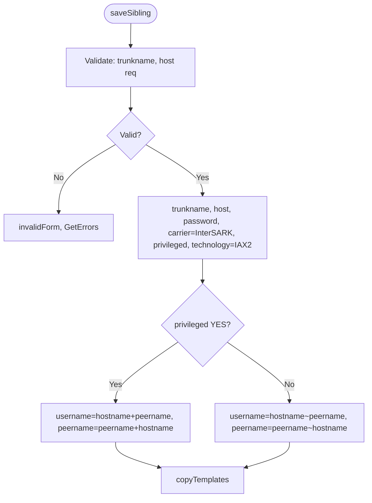

---

## 10. Client-side (current JS) – type → visible fields

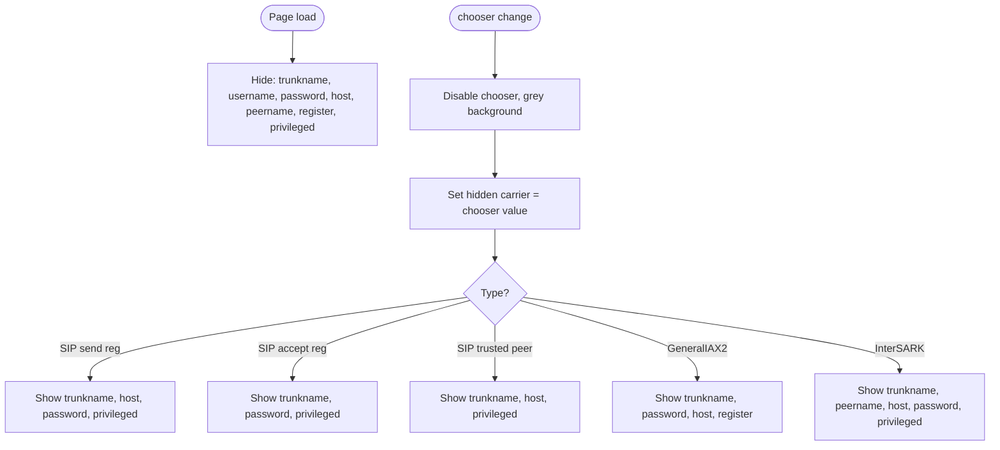

---

## 11. Single diagram – full create path (simplified)

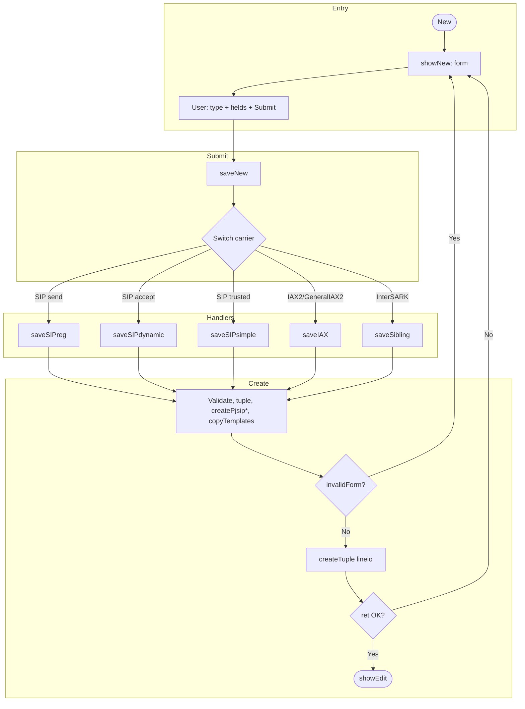

---

## How to use this for the SPA

1. **API:** One endpoint, e.g. `POST /api/trunks`, body: `{ carrier/trunkType, trunkname, host?, password?, peername?, regthistrunk?, privileged? }`. Server runs same switch and handlers, returns 201 + trunk id or 400 + errors.
2. **Client:** One “New trunk” page; chooser drives visibility per diagram 10; submit → API; 201 → navigate to edit; 400 → show errors.
3. **carrier vs chooser:** API should accept chooser values (e.g. `GeneralIAX2`, `SIP (send registration)`) and map `GeneralIAX2` to IAX logic if legacy switch expects `IAX2`.

---

*Working notes – flowcharts for trunk add SPA replacement.*
